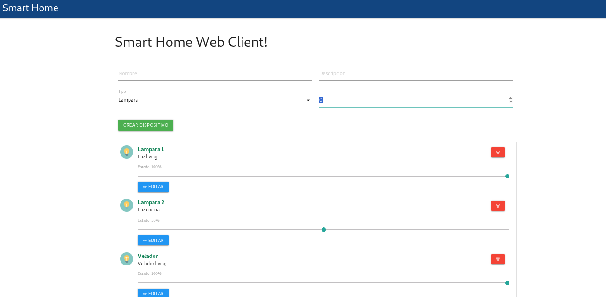

<a href="https://www.gotoiot.com/">
    
</a>

# app-fullstack-base-2025-i11
Web App Full Stack IoT usando Docker, Express, Sequelize, Materialize, Winston, MySQL y más.
## Aplicaciones Web 1
### Entrega Final - Ing. Diego Vazquez

### Tecnologías principales
Docker & Docker Compose – Para contenerizar la app, DB, compilador y admin.

Node.js + Express – Backend REST con estructura de controladores y rutas.

Sequelize – ORM para interactuar con MySQL.

Winston – Sistema de logging avanzado (archivo + consola), con timestamps en zona horaria de BA.

Morgan – Logging de peticiones HTTP.

Materialize CSS – UI del frontend.

TypeScript – Código frontend tipado compilado con Docker.

MySQL 5.7 + PHPMyAdmin – Base de datos relacional.

### Estructura del proyecto

```sh
├── db/  
│   ├── dumps/  
│   │   └── smart_home.sql         # esquema inicial con tabla Devices  
│   └── data/                      # datos persistentes de MySQL  
├── src/  
│   ├── backend/  
│   │   ├── controllers/           # lógica de negocio separada  
│   │   │   └── DevicesController.js  
│   │   ├── routes/                # definiciones de rutas  
│   │   │   └── routesDevice.js  
│   │   ├── utils/  
│   │   │   ├── logger.js          # Winston + path + momento  
│   │   │   └── sanitize.js  
│   │   ├── models/                # definiciones Sequelize  
│   │   │   └── Device.js  
│   │   ├── bd/                    # conexión Sequelize a MySQL  
│   │   │   └── aw1db.js  
│   │   ├── index.js               # arranque de Express + middlewares  
│   └── frontend/  
│       ├── ts/                    # TypeScript fuente  
│       ├── js/                    # JavaScript compilado  
│       ├── static/  
│       │   ├── css/  
│       │   └── img/  
│       └── index.html  
└── docker-compose.yml  
```

### Arquitectura de la aplicación

La aplicación se ejecuta sobre el ecosistema Docker,  diagrama de arquitectura:


## Cómo arrancar la app

### Instalar las dependencias

Para correr este proyecto es necesario que instales `Docker` y `Docker Compose`. 

En [este artículo](https://www.gotoiot.com/pages/articles/docker_installation_linux/) publicado en nuestra web están los detalles para instalar Docker y Docker Compose en una máquina Linux. Si querés instalar ambas herramientas en una Raspberry Pi podés seguir [este artículo](https://www.gotoiot.com/pages/articles/rpi_docker_installation) de nuestra web que te muestra todos los pasos necesarios.

En caso que quieras instalar las herramientas en otra plataforma o tengas algún incoveniente, podes leer la documentación oficial de [Docker](https://docs.docker.com/get-docker/) y también la de [Docker Compose](https://docs.docker.com/compose/install/).

Continua con la descarga del código cuando tengas las dependencias instaladas y funcionando.


### Cloná el repositorio:
```
git clone https://github.com/dvazquez1981/app-fullstack-base-2025-i11.git
```

### Arrancá todo con Docker Compose:
docker compose up 

### Estructura de la DB
Al iniciar el servicio de la base de datos, si esta no está creada toma el archivo que se encuentra en `db/dumps/smart_home.sql` para crear la base de datos automáticamente.
En ese archivo está la configuración de la tabla `Devices` y otras configuraciones más. Si quisieras cambiar algunas configuraciones deberías modificar este archivo y crear nuevamente la base de datos para que se tomen en cuenta los cambios.
Tené en cuenta que la base de datos se crea con permisos de superusuario por lo que no podrías borrar el directorio con tu usuario de sistema, para eso debés hacerlo con permisos de administrador. En ese caso podés ejecutar el comando `sudo rm -r db/data` para borrar el directorio completo.


### Accedé al frontend en:
http://localhost:8000 

### Accedé al PHPMyAdmin en: 
http://localhost:8001 (credenciales root / userpass).


### Configuración de la DB
Para el caso del servicio de NodeJS que se comunica con la DB fijate que en el archivo `src/backend/aw1db.js` están los datos de acceso para ingresar a la base.
Si quisieras cambiar la contraseña, puertos, hostname u otras configuraciones de la DB deberías primero modificar el servicio de la DB en el archivo `docker-compose.yml` y luego actualizar las configuraciones para acceder desde PHPMyAdmin y el servicio de NodeJS.

### Estructura de la DB
Al iniciar el servicio de la base de datos, si esta no está creada toma el archivo que se encuentra en `db/dumps/smart_home.sql` para crear la base de datos automáticamente.
En ese archivo está la configuración de la tabla `Devices` y otras configuraciones más. Si quisieras cambiar algunas configuraciones deberías modificar este archivo y crear nuevamente la base de datos para que se tomen en cuenta los cambios.

Tené en cuenta que la base de datos se crea con permisos de superusuario por lo que no podrías borrar el directorio con tu usuario de sistema, para eso debés hacerlo con permisos de administrador. En ese caso podés ejecutar el comando `sudo rm -r db/data` para borrar el directorio completo.


## Backend

### Controlador dispositivos: lógica CRUD usando Sequelize.

#### Rutas disponibles:
GET /devices, GET /devices/:id
POST /devices (JSON con { name, description, type, state }) (verifica duplicado por name)
PATCH /devices/:id
DELETE /devices/:id

Logger (utils/logger.js):
Tiempo real con Winston (archivo + consola).
Timestamps en America/Argentina/Buenos_Aires.
Archivos de log en src/backend/log/aw1.log.
Consola estilo dev + JSON en producción.
Morgan: middleware que agrega logging de requests HTTP.

### Conexión a base de datos (Sequelize)
Archivo: src/backend/bd/aw1db.js 

### Modelo Sequelize
Archivo: src/backend/models/Device.js


## Frontend
El cliente web es una Single Page Application con Materialize que se comunica con el servicio en NodeJS mediante JSON a través de requests HTTP, con formulario para:
Crear dispositivos (Nombre, Descripción, Tipo, Estado en % de 0 a 100 con paso de 25%).
Listar, editar, actualizar state, actualizar completamente y borrar dispositivos.
Compilado desde TypeScript (src/frontend/ts) a JavaScript (src/frontend/js) usando contenedor Docker en tiempo real.
Esta es la vista del front:



## Log

Ejemplo de log (consola y en aw1.log):

```sh
[2025-06-21 14:20:00] : NodeJS API running correctly
[2025-06-21 14:20:01] : Conexión a MySQL OK.
[2025-06-21 14:20:05] : Obtengo todos los dispositivos
[2025-06-21 14:21:03] : Se encontró device con id=2
```

## Detalles de implementación 💻

En esta sección podés ver los detalles específicos de funcionamiento del código y que son los siguientes.

## Obtener todos los dispositivos (getAll)
### Frontend
En el frontend, cuando se carga la página o se actualiza la lista de dispositivos, se realiza una solicitud HTTP para obtener todos los dispositivos existentes desde el backend.

En el backend se utiliza el método get al endpoint:
`http://localhost:8000/devices`

### Backend
En el backend, se usa la función getAll ubicada en src/backend/controllers/DevicesController.js.

Ruta:
GET /devices

Proceso:
- Se imprime en consola que se están obteniendo todos los dispositivos.
- Se hace una consulta a la base de datos con Device.findAll() usando Sequelize.
- Se sanitizan los datos usando sanitize() antes de enviarlos.
- Se devuelve un JSON con código 200 OK y la lista de dispositivos.

Ejemplo de respuesta exitosa:
```json
[
  {
    "id": 1,
    "name": "Luz cocina",
    "description": "Luz principal de cocina",
    "type": 0,
    "state": 100
  },
  {
    "id": 2,
    "name": "Ventana baño",
    "description": "Ventana con apertura automática",
    "type": 1,
    "state": 50
  }
]
```

Errores posibles:

#### Caso 500 Internal Server Error: si falla la consulta a la base de datos.


## Obtener un dispositivo por ID (getOne)
### Frontend
Desde el frontend, cuando se desea ver o editar un dispositivo específico, se realiza una solicitud al backend con el id del dispositivo seleccionado.
`http://localhost:8000/devices/${id}`

### Backend
En el backend se usa la función getOne también en src/backend/controllers/DevicesController.js.

Ruta:
GET /devices/:id

Proceso:

- Se obtiene el parámetro id de la URL.
- Se valida que el id esté presente.
- Se busca el dispositivo en la base con Device.findOne({ where: { id } }).
- Si se encuentra, se devuelve con código 200 OK.
- Si no se encuentra, se devuelve 404 Not Found.
- En caso de error, se devuelve 500 Internal Server Error.

respuesta exitosa:
```json
{
  "id": 1,
  "name": "Luz cocina",
  "description": "Luz principal de cocina",
  "type": 0,
  "state": 100
}
```
Errores posibles:
#### Caso 400 Bad Request: si no se pasa el id.
```json

{ "message": "id es obligatorio", "status": 0 }
```


#### Caso 404 Not Found: si no existe un dispositivo con ese id.

```json
{ "message": "No se encuentra el Device." }
```

#### Caso 500 Internal Server Error: error inesperado.
```json
{ "message": "Algo salió mal", "data": { "error": "detalle del error" } }

```

## Agregar un dispositivo

### Frontend

Para agregar un dispostivo se ingresa los valores de name, descripcion, el tipo en un select de tipo lampara y ventana y ademas el estado que es un porcentaje de 0 a 100 con un paso de 25
Los campos se validarar para que no esten vacios en el front y tambien en el controlador del backend ademas se comprobara si hay duplicado con respecto al campo name cuando pega en el endpoint del backend como explico posteriormente

### Backend
En el backend se utiliza el método POST al endpoint:
`http://localhost:8000/devices`

con el header:
Content-Type: application/json

El flujo completo es el siguiente: primero el servidor sanitiza la entrada, luego accede al controlador a la funcion crearDevice(req, res) donde verifica paso a paso:
- Que los campos type y state sean numéricos.
- Que state esté dentro del rango de porcentaje válido (0–100) 
- Que type solo tome valores permitidos (0 o 1).
- Que name y description no sean indefinidos ni estén vacíos.
- Que no exista ya un dispositivo con el mismo name en la base de datos.

Una vez superadas todas estas validaciones, se crea el registro y el endpoint devuelve un 201 Created.
Formato de la solicitud (Request)

Se envía en el body un JSON con los campos obligatorios:

```json
{
  "name": "Luz cocina central",
  "description": "Luz de la cocina",
  "type": 0,
  "state": 100
}
``` 

- name (string): nombre único del dispositivo.
- description (string): descripción del dispositivo.
- type (integer): 0 o 1 (luz o ventana)
- state (integer): si type = 0, 0 o 1; si type = 1, un valor entre 0 y 100.


#### Caso que se haya creado con exito status 201
```json
{
    "method": "post",
    "request_headers": "application/json",
    "response_code": 201,
    "request_body": {
        "devices": [
            {
                "message": "Device creado con éxito.",
                "status": 1,
                "data": {
                    "id": 10,
                    "name": "Kitchen Light",
                    "description": "Luz de la cocina",
                    "type": 0,
                    "state": 100
                }
            }
        ]
    }
}
``` 
#### Caso Bad Request (validación fallida) status 400
```json
{ "message": "state debe ser un porcentaje entre 0 y 100", "status": 0 }
```

```json
{ "message": "el valor de type esta mal definido", "status": 0 }
```

```json
{ "message": "name y description deben estar definidos",  "status": 0 }
```

#### Caso 409 Conflict (duplicado)
```json
{ "message": "El Device ya existe. Usa otro name.", "status": 0 }
```

#### Caso 500 Internal Server Error
```json
{ "message": "Error interno.", "status": 0, "error": "Detalle del error" }
```

## Actualizar un dispositivo

### Frontend

En el frontend, para actualizar un dispositivo, se muestran los campos existentes (name, description, type, state) en un formulario. El usuario puede modificar uno o varios valores y enviar la solicitud.
La actualizacion tambien puede ser solo de state. En esta instancia se validara en el caso que se modifique el state que este entre 0 y 100; Y el type que sea 0 o 1.
Esta misma validacion se hara en el controlador del backend ademas de verificar que existe el id.

se realiza un PATCH a:

`http://localhost:8000/devices/:id`

reemplazando :id por el identificador del dispositivo.

### Backend
Se utiliza PATCH al endpoint:
`http://localhost:8000/devices/:id`
con el header:
Content-Type: application/json

Formato de la solicitud (Request)
```json
{
  "name": " Luz Cocina",
  "description": "Luz de la cocina - actualizada",
  "type": 1,
  "state": 75
}
```
o en el caso de solo modificar el state 

```json
{
  "state": 75
}
```

- name (string): nuevo nombre o el mismo.
- description (string): nueva descripción.
- type (integer): 0 o 1.
- state (integer): 0–100.

Proceso de validación y actualización
- La función updateDevice(req, res) realiza:
- Lectura e impresión de req.params.id y req.body.
- Parseo de type y state a enteros.
- Validaciones idénticas a crearDevice:
- Rango de state.
- Valores válidos de type.
- name y description no vacíos.
- Comprobación de existencia: verificar que el dispositivo con id exista.

#### Caso 200 OK
```json
{
  "message": "Device actualizado con éxito.",
  "status": 1,
  "data": {
    "id": 10,
    "name": "Nueva Luz Cocina",
    "description": "Luz de la cocina - actualizada",
    "type": 1,
    "state": 75
  }
}
```
#### Caso 400 Bad Request (validación fallida)
```json
{ "message": "state debe ser un porcentaje entre 0 y 100", "status": 0 }
```
#### Caso 404 Not Found (no existe id)
```json
{ "message": "Device no encontrado.", "status": 0 }
```

#### Caso 500 Internal Server Error
```json
{ "message": "Error interno.", "status": 0, "error": "Detalle del error" }
```


## Eliminar un dispositivo

### Frontend

En el listado de dispositivos, cada elemento tiene un botón “Eliminar”. Al confirmarlo, se envía:

DELETE `http://localhost:8000/devices/:id`

reemplazando :id por el identificador del dispositivo.

### Backend (deleteDevice)

Endpoint:

DELETE `http://localhost:8000/devices/:id`

Header:

Content-Type: application/json


#### Caso 200 OK (eliminación exitosa):
```json
{ "message": "Device eliminado con éxito.", "status": 1 }
```
#### Caso 404 Not Found (no existe id):
```json
{ "message": "Device no encontrado.", "status": 0 }
```
#### Caso 500 Internal Server Error:
```json
{ "message": "Error interno.", "status": 0, "error": "Detalle del error" }
```


### Frontend

Para actualizar un dispositivo en el front se puede, editar todos los campos del device o solo modificar el state ya que se puede variar unicamente ese campo.

### Backend

#### Caso 409 Conflict (duplicado)
```json
{ "message": "El Device ya existe. Usa otro name.", "status": 0 }
```
#### Caso 500 Internal Server Error
```json
{ "message": "Error interno.", "status": 0, "error": "Detalle del error" }
```


## Contribuir 🖇️

Si estás interesado en el proyecto y te gustaría sumar fuerzas para que siga creciendo y mejorando, podés abrir un hilo de discusión para charlar tus propuestas en [este link](https://github.com/gotoiot/app-fullstack-base/issues/new). Así mismo podés leer el archivo [Contribuir.md](https://github.com/gotoiot/gotoiot-doc/wiki/Contribuir) de nuestra Wiki donde están bien explicados los pasos para que puedas enviarnos pull requests.

## Sobre Goto IoT 📖

Goto IoT es una plataforma que publica material y proyectos de código abierto bien documentados junto a una comunidad libre que colabora y promueve el conocimiento sobre IoT entre sus miembros. Acá podés ver los links más importantes:

* **[Sitio web](https://www.gotoiot.com/):** Donde se publican los artículos y proyectos sobre IoT. 
* **[Github de Goto IoT:](https://github.com/gotoiot)** Donde están alojados los proyectos para descargar y utilizar. 
* **[Comunidad de Goto IoT:](https://groups.google.com/g/gotoiot)** Donde los miembros de la comunidad intercambian información e ideas, realizan consultas, solucionan problemas y comparten novedades.
* **[Twitter de Goto IoT:](https://twitter.com/gotoiot)** Donde se publican las novedades del sitio y temas relacionados con IoT.
* **[Wiki de Goto IoT:](https://github.com/gotoiot/doc/wiki)** Donde hay información de desarrollo complementaria para ampliar el contexto.

## Muestas de agradecimiento 🎁

Si te gustó este proyecto y quisieras apoyarlo, cualquiera de estas acciones estaría más que bien para nosotros:

* Apoyar este proyecto con una ⭐ en Github para llegar a más personas.
* Sumarte a [nuestra comunidad](https://groups.google.com/g/gotoiot) abierta y dejar un feedback sobre qué te pareció el proyecto.
* [Seguirnos en twitter](https://github.com/gotoiot/doc/wiki) y dejar algún comentario o like.
* Compartir este proyecto con otras personas.

## Autores 👥

Las colaboraciones principales fueron realizadas por:

* **[Agustin Bassi](https://github.com/agustinBassi)**: Ideación, puesta en marcha y mantenimiento del proyecto.
* **[Ernesto Giggliotti](https://github.com/ernesto-g)**: Creación inicial del frontend, elección de Material Design.
* **[Brian Ducca](https://github.com/brianducca)**: Ayuda para conectar el backend a la base de datos, puesta a punto de imagen de Docker.

También podés mirar todas las personas que han participado en la [lista completa de contribuyentes](https://github.com/###/contributors).

## Licencia 📄

Este proyecto está bajo Licencia ([MIT](https://choosealicense.com/licenses/mit/)). Podés ver el archivo [LICENSE.md](LICENSE.md) para más detalles sobre el uso de este material.

---

**Copyright © Goto IoT 2021** ⌨️ [**Website**](https://www.gotoiot.com) ⌨️ [**Group**](https://groups.google.com/g/gotoiot) ⌨️ [**Github**](https://www.github.com/gotoiot) ⌨️ [**Twitter**](https://www.twitter.com/gotoiot) ⌨️ [**Wiki**](https://github.com/gotoiot/doc/wiki)
